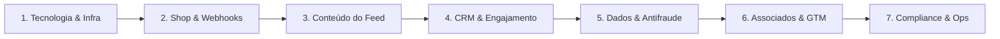

# 🚀 Checklist Executivo de Go-Live & Lançamento Oficial — Netfits Fidelidade Ltda.

> **Status**: Planejamento Final de Lançamento (Fase Beta ➔ Go-Live Público)  
> **Premissa Operacional**: O **Netfits Shop** e o seu **Checkout** serão operados 100% por um **parceiro comercial externo credenciado**, com captura de vendas e atribuição de cashback em pontos `nfs` via integração de postback/webhooks e rastreamento de afiliados.

---

## 📋 Resumo das Fases do Checklist

---

## 🛠️ 1. Tecnologia & Infraestrutura de Plataforma

- [ ] **Hospedagem & CDN Edge**:
  - [ ] Validar deploy de produção no Cloudflare Pages / Workers com SSL/TLS ativo.
  - [ ] Configurar domínio oficial `netfits.com.br` e subdomínios `app.netfits.com.br` e `admin.netfits.com.br`.
  - [ ] Configurar roteamento SPA no Cloudflare com regra de fallback `_redirects` para `/index.html`.
- [ ] **Mobile PWA & Casca Nativa**:
  - [ ] Configurar `manifest.json` com ícones oficiais (192x192, 512x512), tema escuro `#0f0f14` e suporte a instalação PWA ("Add to Home Screen").
  - [ ] Testar compatibilidade de visualização em dispositivos iOS (Safari PWA) e Android (Chrome PWA).
  - [ ] Preparar wrappers de visualização nativa para submissão futura na Apple App Store e Google Play Store.
- [ ] **Autenticação & Segurança de Acesso**:
  - [ ] Testar fluxo de cadastro e login (E-mail/Senha, Google OAuth, Magic Link).
  - [ ] Implementar verificação de e-mail obrigatória e recuperação de senha.
  - [ ] Configurar controle de acesso RBAC (*Role-Based Access Control*) diferenciando perfis: **Usuário Comum**, **Associado Netfits (Categoria Única)** e **Admin Executivo**.

---

## 🛍️ 2. Integração do Marketplace (Shop Parceiro Externo & Checkout)

- [ ] **Modelagem do Checkout Externo**:
  - [ ] Definir o parceiro gestor do e-commerce (ex: Netshoes, Centauro, Decathlon, parceiro agregador).
  - [ ] Configurar o modelo de redirecionamento transparente com parâmetro de rastreamento `utm_source=netfits` e `subid={userId}`.
- [ ] **API de Webhooks & Postback de Transações**:
  - [ ] Criar endpoint seguro `/api/v1/webhooks/shop-partner` com validação de assinatura HMAC.
  - [ ] Processar eventos de transação: `sale_approved`, `sale_canceled`, `refund_requested`.
  - [ ] Calcular a comissão Netfits (**8,0% Take-Rate padrão**) e a creditação do cashback para o usuário em pontos `nfs`.
- [ ] **Regras do Cashback em Pontos `nfs`**:
  - [ ] Configurar parâmetro `nfsEarnedPerBrlSpent = 0.50` (compras padrão) e `1.00` (compras no Netfits Club).
  - [ ] Adicionar bônus de primeira compra (`shopFirstPurchaseBonusNfs = 150 nfs`).
  - [ ] Configurar prazo de liberação do cashback (ex: 7 a 14 dias após a entrega do produto para expiração do prazo legal de arrependimento).

---

## 📰 3. Criação de Conteúdo Real & Grade Editorial do Feed

- [ ] **Grade Editorial de Lançamento (Lote Inicial de 30 Conteúdos)**:
  - [ ] Produzir 10 artigos curados sobre **Treino & Corrida** (ex: *"Como estruturar seu primeiro ciclo de treinos para 10k"*).
  - [ ] Produzir 10 artigos sobre **Nutrição & Suplementação** (ex: *"Creatina vs Palatinose: qual o momento ideal de consumo?"*).
  - [ ] Produzir 10 posts/vídeos curtos sobre **Recovery & Saúde Mental** (ex: *"Protocolos de sono e mobilidade para atletas amadores"*).
- [ ] **Mecânica de Recompensas por Leitura e Compartilhamento**:
  - [ ] Validar a concessão automática de `+5 nfs` por leitura completa do artigo (tempo mínimo de scroll de 15 segundos).
  - [ ] Validar a concessão de `+10 nfs` por compartilhamento verificado no WhatsApp / redes sociais.
  - [ ] Testar as travas antifraude de limite diário (`dailyRewardedPostLimit = 3`) e semanal (`weeklyRewardedPostLimit = 15`).
- [ ] **Feed Social & Integração com Wearables**:
  - [ ] Testar cards de sincronização GPS de treinos (Garmin Connect, Strava).
  - [ ] Validar creditação do bônus de treino (`+50 nfs por treino validado`).

---

## 📬 4. CRM, Notificações & Réguas de Engajamento

- [ ] **Plataforma de CRM (OneSignal / Braze / SendGrid / Resend)**:
  - [ ] Configurar integração com provedor de e-mail transacional e notificações Push.
- [ ] **Réguas de Comunicação Automatizada**:
  - [ ] **Régua 1 (Boas-Vindas - Dia 1)**: E-mail de recepção, explicação dos pontos `nfs` e presente de cadastro (+50 nfs).
  - [ ] **Régua 2 (Engajamento - Dia 3)**: Notificação convidando o usuário a ler seu primeiro artigo no Feed e ganhar +5 nfs.
  - [ ] **Régua 3 (Primeira Compra - Dia 7)**: Oferta com selo de cashback no Netfits Shop com parceiro externo.
  - [ ] **Régua 4 (Aviso de Validade FEFO)**: Notificação com 30, 15 e 7 dias de antecedência antes do vencimento de um lote de pontos.
  - [ ] **Régua 5 (Conversão Netfits Club - Fase 2)**: Convite para assinatura por R$ 19,90/mês para multiplicar pontos em dobro.

---

## 📊 5. Dados, Business Intelligence & Antifraude

- [ ] **Engine de Telemetria & Analytics**:
  - [ ] Instalar rastreamento de eventos (Google Analytics 4, Mixpanel ou PostHog).
  - [ ] Acompanhar métricas principais (DAU, MAU, Taxa de Leitura, GMV do Shop, Pontos Emitidos e Resgatados).
- [ ] **Painel de Controle Admin (Realtime)**:
  - [ ] Garantir que o painel `/admin` reflita em tempo real os novos parâmetros padrão:
    - Take Rate Shop: **8,0%**
    - CPP Acúmulo: **R$ 0,02**
    - CPP Resgate: **R$ 0,01**
    - CPP Provisão: **R$ 0,01**
    - Mensalidade Club: **R$ 19,90/mês**
  - [ ] Validar o cálculo automatizado da DRE (Fase 1 Launch vs Fase 2 Clube).
- [ ] **Motor Antifraude do Programa de Pontos**:
  - [ ] Bloqueio de múltiplos cadastros por mesmo IP ou dispositivo (Fingerprinting).
  - [ ] Detecção de bots e automação de cliques/visualizações de artigos.
  - [ ] Trava de resgate para contas suspeitas com auditoria manual do Admin.

---

## 🤝 6. Rede de Associados & Estratégia Go-to-Market (GTM)

- [ ] **Onboarding dos Primeiros Associados (Beta Launch com 50 Criadores/Treinadores)**:
  - [ ] Cadastrar os primeiros **Associados Netfits** na categoria única (**10,0% de comissão padrão**).
  - [ ] Testar a geração e acompanhamento dos **Links de Indicação Únicos (`referralCode`)**.
  - [ ] Validar o Painel do Associado (`/associado`) mostrando a árvore de indicados, comissões em R$ acumuladas e solicitação de saque.
- [ ] **Kit de Divulgação para Associados**:
  - [ ] Disponibilizar mídias oficiais, banners, materiais para Instagram e templates de mensagens para WhatsApp.

---

## ⚖️ 7. Jurídico, Compliance & Operações de Suporte

- [ ] **Termos de Uso & Políticas Legais**:
  - [ ] Publicar **Termos de Serviço** contemplando a mecânica do programa de recompensas e a responsabilidade da entrega dos produtos pelo parceiro externo do Shop.
  - [ ] Publicar **Política de Privacidade & LGPD** explicitando o tratamento de dados consentidos de treino e hábitos.
  - [ ] Publicar o **Regulamento do Programa de Pontos `nfs`**:
    - Regra do **FEFO (*First-Expiring, First-Out*)**.
    - Validade de **24 meses** dos lotes de pontos.
    - Custo de provisão de **R$ 0,01 / nfs**.
- [ ] **Canais de Atendimento ao Cliente**:
  - [ ] Criar canal de suporte (E-mail `suporte@netfits.com.br`, WhatsApp Oficial e FAQ interno).
  - [ ] Treinar equipe de suporte com procedimentos de resolução para dúvidas sobre cashback de parceiros, pontos não creditados e regras do programa.

---

## 📅 Cronograma de Execução Pré-Lançamento

| Semana | Foco Principal | Entregáveis Chave |
| :---: | :--- | :--- |
| **Semana 1** | **Tech & Integrations** | Setup do servidor SPA, webhooks do parceiro de Shop e autenticação. |
| **Semana 2** | **Conteúdo & CRM** | Cadastro de 30 artigos reais no Feed, réguas de e-mail/push e regras antifraude. |
| **Semana 3** | **Associados & Testes** | Onboarding do lote beta de 50 Associados, simulação de compras no Shop e testes FEFO. |
| **Semana 4** | **Go-Live Público** | Liberação oficial do acesso ao público, anúncio para a comunidade e monitoramento DRE. |
