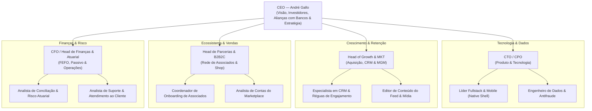

# 🏛️ Estrutura Organizacional Ótima — Netfits Fidelidade Ltda.

> **Escopo Executivo**: Arquitetura Organizacional, Governança e Matriz de Talentos para o Lançamento e Escala da Netfits  
> **Liderança**: **CEO (André Gallo)**  
> **Premissa Operacional**: Modelo *Lean & Capital-Efficient*, focado em tecnologia serverless, marketplace afiliado com checkout externo credenciado e atração por ecossistema B2B2C (Associados Netfits).

---

## 📌 1. Visão Geral da Tese Organizacional

A Netfits não deve nascer como uma corporação pesada com muitos níveis hierárquicos. Seu sucesso depende de **velocidade de execução, inteligência atuarial (motor FEFO) e relacionamentos estratégicos B2B2C**.

Para funcionar com máxima eficiência, a estrutura da empresa deve ser organizada em torno de **5 Pilares de Tração**:
1. **Liderança Estratégica & Alianças (CEO)**
2. **Produto, Engenharia de Dados & Antifraude (CTO/CPO)**
3. **Growth, CRM & Comunidade (Head of Growth)**
4. **Rede B2B2C, Associados & Marketplace (Head de Parcerias)**
5. **Finanças, Gestão Atuarial & Operações (CFO/Head Operacional)**

---

## 📊 2. Organograma Executivo (Reporting Lines)

---

## 🎯 3. Detalhamento das Frentes Estratégicas & Atribuições

### 1. CEO — Liderança Executiva (André Gallo)
- **Foco Principal**: Visão estratégica, governança, captação de recursos (Rodada Seed de R$ 4M a R$ 8M), alianças com bancos/programas de pontos (Itaú, Livelo, C6, Santander) e grandes marcas do esporte.
- **Principais Atribuições**:
  - Representar a Netfits perante investidores, conselho e mercado.
  - Fechar negociações bilaterais de grande porte (integração bancária e grandes redes de varejo).
  - Manter o alinhamento com a cultura do *Código Netfits* (*Usuário antes do ego | Clareza | Evidência | Velocidade*).
  - Garantir a alocação eficiente do capital captado.

---

### 2. Diretoria de Produto & Tecnologia (CTO / CPO)
- **Foco Principal**: Construção da plataforma digital (native shell PWA), estabilidade dos conectores, inteligência de dados e proteção antifraude.
- **Equipe (Fase 1 Launch)**:
  - 1x **Líder de Engenharia Fullstack & Mobile**: Responsável pelo App Web/PWA, rotas TanStack, integração de webhooks/postbacks de compras.
  - 1x **Engenheiro de Dados & Antifraude**: Responsável pelo motor de emissão de pontos, algoritmo FEFO, prevenção contra múltiplos cadastros e futuras integrações com Garmin, Strava e Apple Health.
- **OKRs da Área**:
  - Uptime do aplicativo > 99,9%.
  - Tempo de resposta das APIs de postback de compras < 200ms.
  - Índice de suspeita de fraude em pontos < 0,1%.

---

### 3. Diretoria de Growth, CRM & Comunidade (Head of Growth)
- **Foco Principal**: Aquisição sustentável de esportistas amadores, engajamento diário no Feed e retenção no Netfits Club.
- **Equipe (Fase 1 Launch)**:
  - 1x **Especialista em CRM & Réguas de Automação**: Configuração de réguas de e-mail/push/WhatsApp, notificações de expiração FEFO e recuperação de inativos.
  - 1x **Curador & Editor de Conteúdo do Feed**: Gestão do calendário editorial, curadoria de artigos de treinos/suplementos e integração de mídias patrocinadas por marcas.
- **OKRs da Área**:
  - Custo de Aquisição de Clientes (CAC Orgânico + MGM) < R$ 18,50.
  - Taxa de Engajamento Mensal (MAU / Registrados) > 25%.
  - Conversão de usuários para o Netfits Club (R$ 19,90/mês) > 8%.

---

### 4. Diretoria de Parcerias, B2B2C & Associados (Head de Parcerias)
- **Foco Principal**: Expansão da **Rede de Associados Netfits (categoria única de 10,0% de comissão)** e captação de marcas para o Marketplace.
- **Equipe (Fase 1 Launch)**:
  - 1x **Coordenador de Onboarding de Associados**: Onboarding de criadores de conteúdo, treinadores, assessorias de corrida, médicos esportivos e atribuição vitalícia de carteiras.
  - 1x **Analista de Contas do Marketplace**: Relacionamento com e-commerces (Netshoes, Centauro, Decathlon, Hoka, ON, suplementos) e gestão do Take Rate de 8,0%.
- **OKRs da Área**:
  - Onboarding de 50 a 200 novos Associados ativos por trimestre.
  - GMV transacionado via links de afiliados / parceiros > R$ 1,5M no Ano 1.
  - Retenção da rede de Associados > 90%.

---

### 5. Diretoria de Finanças, Gestão Atuarial & Operações (CFO / Controller)
- **Foco Principal**: Solidez atuarial dos pontos `nfs`, controle do passivo diferido, reserva em caixa (FEFO), conciliação bancária, compliance e suporte.
- **Equipe (Fase 1 Launch)**:
  - 1x **Analista de Conciliação & Risco Atuarial**: Monitoramento do CPP de acúmulo (R$ 0,02), resgate (R$ 0,01), provisão (R$ 0,01) e aplicação do breakage de 12,0%.
  - 1x **Analista de CX & Atendimento**: Suporte ao usuário para dúvidas sobre resgates, pontos e cashback no Shop.
- **OKRs da Área**:
  - Cobertura em caixa do passivo de pontos = 100% (Reserva de R$ 88.842,00 na Fase 1).
  - Fechamento mensal da DRE e conciliação de cashback até o 5º dia útil.
  - Tempo médio de resposta no suporte (CSAT) > 90%.

---

## 📈 4. Matriz de Evolução do Headcount (Faseamento por Maturação)

| Fase de Maturação | Objetivo Principal | Tamanho do Time | Foco de Contratação |
| :--- | :--- | :---: | :--- |
| **Fase 1: Launch & Tração (0 a 12 Meses)** | Validar PMF, 50k usuários, R$ 15M GMV, provar motor FEFO. | **6 a 8 Pessoas** | CEO + CTO + Head Growth + Head Parcerias + Fullstack + CRM + Onboarding Associados + CX. |
| **Fase 2: Hábitos & Wearables (12 a 24 Meses)** | Lançamento do Netfits Club (R$ 19,90), conexão Strava/Garmin, 250k usuários. | **12 a 16 Pessoas** | +2 Devs Mobile/Data, +1 Designer UX/UI, +1 Analista de Mídia Patrocinada, +1 Gerente Financeiro, +2 Suporte. |
| **Fase 3: Longevidade & Expansão (24 a 36 Meses)** | Serviços premium de healthspan, 1 milhão de usuários, entrada em LATAM. | **25 a 35 Pessoas** | +Time Clínico/Parcerias Médicas, +Data Scientists, +Expansão Internacional, +Compliance LGPD/Saúde. |

---

## ⚖️ 5. Governança Executiva & Rituais de Gestão (CEO Office)

Para garantir que você, como **CEO**, tenha total visibilidade sem se afogar na operação diária, recomendamos os seguintes rituais:

1. **Reunião Semanal de Alinhamento (Executive Weekly — Segundas-feiras, 9h)**:
   - Acompanhamento dos **KPIs Norte (MAU, GMV do Shop, Pontos Emitidos vs Resgatados, Saldo de Caixa FEFO e Novas Assinaturas Club)**.
2. **Reunião de Produto & Antifraude (Bi-semanal — Quarta-feira)**:
   - Validação do roadmap de entregas, performance das APIs e auditoria de sinistralidade de pontos.
3. **Conselho Consultivo & Relação com Investidores (Mensal)**:
   - Apresentação da DRE proforma atualizada, margem EBITDA e avanço das conversações estratégicas com bancos.
